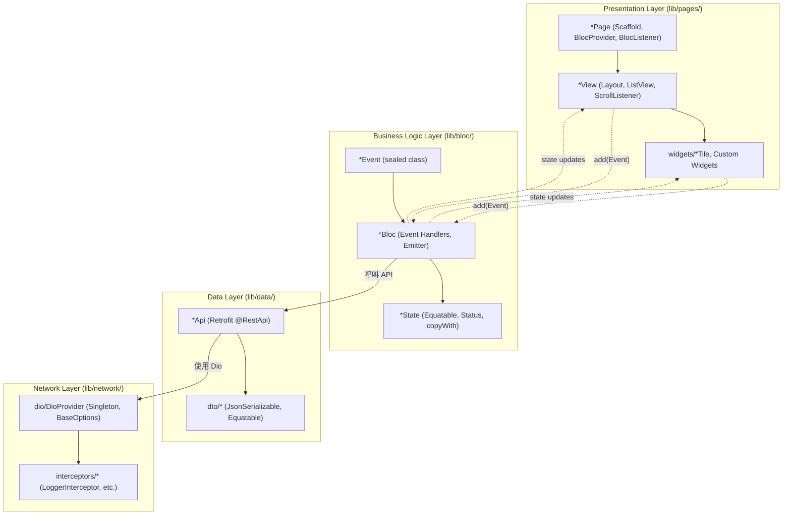
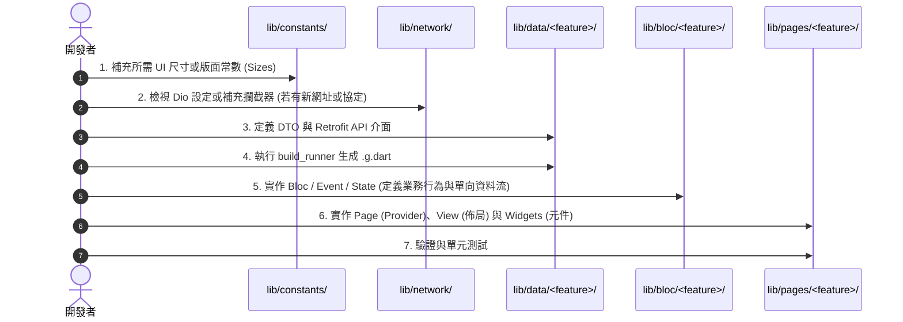

# 專案架構指南與實作參考索引 (Architecture Guide)

本文件定義專案 `lib/` 目錄的架構分層、各模組單一職責（Single Responsibility）以及後續新增或修改功能時的實作參考索引。遵循 Clean Architecture 功能優先（Feature-First）與實用主義（Pragmatic）原則。

---

## 1. 架構全景與資料流 (Architecture Overview)

專案採用嚴格的單向資料流（Unidirectional Data Flow），依賴關係自上而下，UI 僅向 BLoC 發送事件，BLoC 透過 Data/Network 獲取資料並驅動 State 變更映射回 UI。



### 橫向匯出原則 (Barrel Files)
每個功能模組目錄皆提供統一的 barrel 匯出檔（如 `bloc.dart`、`dto.dart`、`network.dart`、`constants.dart`），對外公開合約，減少繁雜的跨層相對路徑引用。

---

## 2. 各模組職責與實作索引 (Module Reference Index)

### 2.1 常數層 (`lib/constants/`)

* **位置**：`lib/constants/`
* **目前檔案**：
  * [sizes.dart](file:///Users/yomiry/StudioWorkspace/flutter_home_work/lib/constants/sizes.dart)：全域 UI 尺寸規格（Padding、Margin、Radius、Icon、Divider、Font 等）。
  * [constants.dart](file:///Users/yomiry/StudioWorkspace/flutter_home_work/lib/constants/constants.dart)：Barrel 匯出檔。
* **職責**：
  * 集中管理非動態的版面維度與佈局常數，消除 UI 程式碼中的 Magic Numbers。
  * 顏色與文字樣式不放在此處（顏色由 `gen/colors.gen.dart` 管理，多語系字串由 `generated/l10n.dart` 管理）。
* **新增／修改規範**：
  1. 新增維度時，以 `static const double` 宣告於 [Sizes](file:///Users/yomiry/StudioWorkspace/flutter_home_work/lib/constants/sizes.dart) 類別中，命名格式為 `範疇 + 尺寸層級`（如 `paddingXXS`, `radiusM`, `iconL`）。
  2. 若有特定業務常數（如分頁預設筆數、音訊快取限制），應建立專屬常數類別並透過 [constants.dart](file:///Users/yomiry/StudioWorkspace/flutter_home_work/lib/constants/constants.dart) 匯出。

---

### 2.2 網路客戶端層 (`lib/network/dio/`)

* **位置**：`lib/network/dio/`
* **目前檔案**：
  * [dio_provider.dart](file:///Users/yomiry/StudioWorkspace/flutter_home_work/lib/network/dio/dio_provider.dart)：Dio 單例工廠。
  * [dio.dart](file:///Users/yomiry/StudioWorkspace/flutter_home_work/lib/network/dio/dio.dart)：Barrel 匯出檔。
* **職責**：
  * 初始化與持有全域 `Dio` 單例實例。
  * 配置全域 `BaseOptions`（`baseUrl`、連線超時、接收超時、共用 Headers）。
  * 裝配全域 Interceptor（如 [LoggerInterceptor](file:///Users/yomiry/StudioWorkspace/flutter_home_work/lib/network/interceptors/log_interceptor.dart)）。
* **新增／修改規範**：
  1. **禁止在各 API 客戶端分散設置 `baseUrl`**，全域 URL 統一由 App 啟動時（如 `main()`）透過 `DioProvider.init(baseUrl: ...)` 傳入。
  2. 建構式嚴格維持私有（`DioProvider._internal`），禁止公開建構式。
  3. 存取統一透過靜態 getter `DioProvider.dio` 或 `DioProvider.instance`（或 `DioProvider.I`）。
  4. 若需環境變數切換（dev/prod），在初始化時傳入對應環境的 `baseUrl`。

---

### 2.3 網路攔截器層 (`lib/network/interceptors/`)

* **位置**：`lib/network/interceptors/`
* **目前檔案**：
  * [log_interceptor.dart](file:///Users/yomiry/StudioWorkspace/flutter_home_work/lib/network/interceptors/log_interceptor.dart)：請求/回應/錯誤的日誌記錄器與耗時統計。
  * [interceptors.dart](file:///Users/yomiry/StudioWorkspace/flutter_home_work/lib/network/interceptors/interceptors.dart)：Barrel 匯出檔。
* **職責**：
  * 封裝橫切關注點（Cross-cutting Concerns），如請求追蹤、耗時統計、權限 Token 附加、全域錯誤攔截。
* **新增／修改規範**：
  1. 繼承 Dio 的 `Interceptor` 類別，覆寫 `onRequest`、`onResponse`、`onError`。
  2. 計算請求耗時需善用 `options.extra['start_at']`，避免全域變數污染。
  3. 一律使用 `package:logger`（`Logger().i` / `Logger().e`），**嚴禁使用 `print`**。
  4. 必須正確調用 `handler.next(...)`、`handler.resolve(...)` 或 `handler.reject(...)`，絕不能遺漏導致請求中斷掛起。

---

### 2.4 資料層 (`lib/data/`)

* **位置**：`lib/data/<feature>/`（注意：現有目錄 `data/paly_list/` 為筆誤，後續新功能請使用標準命名 `data/<feature>/`）
* **目前檔案結構**：
  * `lib/data/paly_list/play_list_api.dart`：Retrofit 介面定義。
  * `lib/data/paly_list/dto/`：Data Transfer Objects。
    * [rsp_play_list.dart](file:///Users/yomiry/StudioWorkspace/flutter_home_work/lib/data/paly_list/dto/rsp_play_list.dart)：API 回應外層封裝。
    * [play_list_item.dart](file:///Users/yomiry/StudioWorkspace/flutter_home_work/lib/data/paly_list/dto/play_list_item.dart)：播放項目實體資料。
    * `dto.dart`：DTO Barrel 匯出檔。
  * `play_list.dart`：Feature 資料層 Barrel 匯出檔。
* **職責**：
  * 定義 HTTP 遠端服務合約（Retrofit API）。
  * 定義 JSON 資料對應模型（DTO），處理序列化與反序列化。
* **新增／修改規範**：
  1. **目錄組織**：依 Feature 劃分資料目錄（`lib/data/<feature_name>/`），底下固定拆分為 `dto/` 與 `<feature_name>_api.dart`。
  2. **Retrofit API 寫法**：
     * 宣告 `@RestApi()`，**不填寫 `baseUrl`**。
     * Path 必須以斜線 `/` 開頭（例如 `@GET('/open-api/{lang}/Media/Audio')`）。
     * 需標註 `part '<feature_name>_api.g.dart';`。
  3. **DTO 撰寫規則**：
     * 宣告 `@JsonSerializable()` 與 `part '<file_name>.g.dart';`。
     * 繼承 `Equatable`，並**完整覆寫 `props`**（注意：絕不能留空 `props => []`，否則會破壞物件比對與快取驗證）。
     * 提供 `copyWith` 方法以利不可變資料的複製。
     * 屬性型別預設使用 nullable（`final int? id;`），以抵禦後端欄位缺失。
  4. **程式碼生成**：變更 DTO 或 API 後，必須執行：
     ```bash
     rtk dart run build_runner build --delete-conflicting-outputs
     ```

---

### 2.5 業務邏輯層 (`lib/bloc/`)

* **位置**：`lib/bloc/<feature>/`
* **目前檔案**：
  * [status.dart](file:///Users/yomiry/StudioWorkspace/flutter_home_work/lib/bloc/status.dart)：全域共用狀態列舉（`initial`, `loading`, `success`, `failure`）與 `StatusX` 擴充方法。
  * `lib/bloc/play_list/`：
    * [get_play_list_bloc.dart](file:///Users/yomiry/StudioWorkspace/flutter_home_work/lib/bloc/play_list/get_play_list_bloc.dart)：清單載入邏輯。
    * [get_play_list_event.dart](file:///Users/yomiry/StudioWorkspace/flutter_home_work/lib/bloc/play_list/get_play_list_event.dart)：清單事件定義。
    * [get_play_list_state.dart](file:///Users/yomiry/StudioWorkspace/flutter_home_work/lib/bloc/play_list/get_play_list_state.dart)：清單狀態定義。
    * [download_bloc.dart](file:///Users/yomiry/StudioWorkspace/flutter_home_work/lib/bloc/play_list/download_bloc.dart)：檔案下載與進度狀態邏輯。
    * `play_list.dart`：Feature BLoC Barrel 匯出檔。
  * [bloc.dart](file:///Users/yomiry/StudioWorkspace/flutter_home_work/lib/bloc/bloc.dart)：全域 BLoC Barrel 匯出檔。
* **職責**：
  * 專注處理單一業務領域的狀態轉換與非同步副作用（如 API 呼叫、本機檔案下載）。
  * 對外僅暴露唯讀 State，嚴禁在 BLoC 類別中宣告 public 可變欄位。
* **新增／修改規範**：
  1. **檔案組織（Part 模式）**：
     * 採用 `part` 與 `part of` 將 Event 與 State 聚合在同一編譯單元：
       ```dart
       // in <feature>_bloc.dart
       part '<feature>_event.dart';
       part '<feature>_state.dart';
       ```
     * 外部僅需 `import '<feature>_bloc.dart'` 或 barrel 檔即可同時取得 Bloc/Event/State。
  2. **Event 規範**：
     * 基類宣告為 `sealed class <Name>Event extends Equatable`。
     * 子類別命名保持明確意圖（如 `Init`, `Query`, `Refresh`, `Success`, `Fail`）。
  3. **State 規範**：
     * 採用單一狀態類別搭配 `final class <Name>State extends Equatable` 與 `copyWith`。
     * 內嵌 `Status status = Status.initial;` 表達標準生命週期。
     * 計算屬性（Derived properties）使用 `extension <Name>StateX on <Name>State`（如 `hasMore`、`isDownloaded`），避免狀態資料冗餘。
  4. **副作用處理**：
     * 非同步請求需加防抖或重複觸發守衛（如 `if (state.status.isLoading) return;`）。
     * 捕捉例外時一律記錄日誌，發送失敗狀態（`add(<Name>Fail(...))` 或 `emit(state.copyWith(status: Status.failure))`）。

---

### 2.6 展示層 (`lib/pages/`)

* **位置**：`lib/pages/<feature>/`
* **目前檔案**：
  * `lib/pages/play_list/`：
    * [play_list_page.dart](file:///Users/yomiry/StudioWorkspace/flutter_home_work/lib/pages/play_list/play_list_page.dart)：畫面容器與 Provider 配置。
    * `widgets/play_list_view.dart`：清單佈局、分頁監聽與狀態分流。
    * `widgets/play_list_tile.dart`：獨立清單項目元件。
    * `play_list.dart`：頁面與元件 Barrel 匯出檔。
  * `lib/pages/play_detail/`：
    * [play_detail_page.dart](file:///Users/yomiry/StudioWorkspace/flutter_home_work/lib/pages/play_detail/play_detail_page.dart)：音訊播放詳細頁。
* **職責**：
  * 將 BLoC 狀態渲染為 UI，並將使用者操作委派為 BLoC 事件。
  * 管理畫面專屬之 Controller（如 `ScrollController`、`AudioPlayer`）生命週期。
* **新增／修改規範**：
  1. **Page 與 View 職責分離**：
     * `*Page`：負責 `Scaffold`、`BlocProvider` / `MultiBlocProvider` 宣告、以及全域 `BlocListener`。
     * `*View`：負責實際 UI 佈局、`BlocBuilder` 狀態分流（loading / failure / empty / success）、分頁滾動監聽。
  2. **Widget 提取原則（嚴禁 Private Helper Method）**：
     * 將子元件拆分為獨立類別（如 `class PlayListTile extends StatelessWidget`、`class _ActionButton extends StatelessWidget`）。
     * **嚴禁使用 `_buildTile()` 這類私有方法建立 UI**，確保 Flutter 渲染樹能夠精確局部重繪。
  3. **樣式與資源引用**：
     * 間距與尺寸：一律使用 `Sizes.*`（如 `Sizes.paddingL`, `Sizes.radiusS`）。
     * 留白：優先使用 `const SizedBox(width: ..., height: ...)`，勿用無背景的 `Container`。
     * 分隔線：清單間隔統一使用 `ListView.separated`。
     * 顏色：一律使用 `ColorName.*`（來自 `gen/colors.gen.dart`）。
     * 多語系：一律使用 `S.of(context).*`（來自 `generated/l10n.dart`）。
  4. **非同步與生命週期安全**：
     * 跨越 `await` 後若需存取 `context` 或呼叫 `setState`，必須先加上 `if (!mounted) return;` 守衛。
     * 在 `State.dispose()` 中務必及時銷毀所有 Controller/Subscription，並將 `super.dispose()` 置於最後。

---

## 3. 開發實作工作流程索引 (Implementation Workflow)

當需要新增或修改一項功能時，請遵循由下而上的實作步驟：



### 檢查清單 (Checklist)

- [ ] **Data 層**：
  - [ ] `@RestApi()` 宣告是否去除了 `baseUrl`？
  - [ ] DTO 是否繼承 `Equatable` 且完整填寫了 `props` 欄位？
  - [ ] 是否已執行 `rtk dart run build_runner build` 生成程式碼？
- [ ] **BLoC 層**：
  - [ ] 是否使用 `part` / `part of` 保持 Event/State 緊湊？
  - [ ] 是否消除了 public 可變欄位？
  - [ ] 載入資料前是否有防重複觸發防護（如 `status.isLoading` 檢查）？
  - [ ] 失敗情境是否皆有適當的 logger 輸出與 Failure 狀態？
- [ ] **Pages 層**：
  - [ ] 是否區分了 `*Page` 與 `*View`？
  - [ ] 是否消除了 `_buildSubWidget()` 私有方法，全面改用獨立 Widget 類別？
  - [ ] 尺寸是否引用 `Sizes.*`、顏色引用 `ColorName.*`、字串引用 `S.of(context).*`？
  - [ ] `ScrollController` 等監聽物件是否於 `dispose` 中完整釋放？
- [ ] **整體品質**：
  - [ ] 執行靜態分析確保零 Warning：`rtk dart analyze`。
  - [ ] 格式化程式碼：`rtk dart format .`。

---

## 4. 架構注意事項與已知調整點 (Architecture Insights)

1. **目錄名稱筆誤注意**：
   * 現有清單資料層位於 `lib/data/paly_list/`（有拼寫筆誤）。後續重構修正時需同步更新所有引用路徑；新功能目錄請務必確保拼寫精確。
2. **DTO 的 Equatable 比對**：
   * [rsp_play_list.dart](file:///Users/yomiry/StudioWorkspace/flutter_home_work/lib/data/paly_list/dto/rsp_play_list.dart) 目前之 `props` 為空陣列 `[]`，若修改或比對外層回應時請務必補齊 `[total, data]`，避免物件相等性判斷失效。
3. **Barrel Export 集中度**：
   * 新增任何子模組時，務必在同層級的 barrel 檔（如 `dto.dart`、`widgets.dart`、`<feature>.dart`）補上 export，保持乾淨簡潔的公開導入介面。
